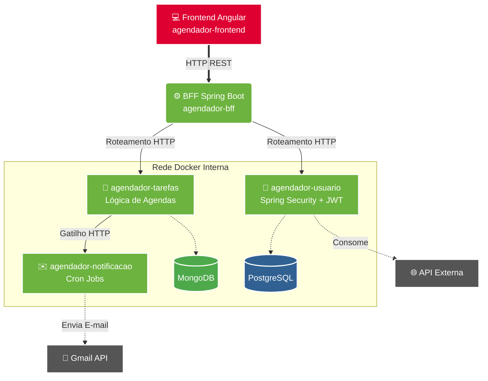

# 📅 Agendador de Tarefas

Sistema completo de gerenciamento de tarefas pessoais desenvolvido com arquitetura de microsserviços. O usuário pode se cadastrar, autenticar e criar, editar e excluir suas próprias agendas, recebendo notificações por e-mail sobre tarefas próximas.
---
## 🏗️ Arquitetura


## 📦 Serviços

| Serviço | Repositório | Tecnologia | Responsabilidade |
|---|---|---|---|
| Frontend | [agendador-frontend](https://github.com/AndreLuizDSM/agendador-frontend) | Angular · TypeScript · SCSS | Interface do usuário |
| BFF | [agendador-bff](https://github.com/AndreLuizDSM/agendador-bff) | Java · Spring Boot | Gateway, orquestração, Swagger, tratamento de erros |
| Tarefas | [agendador-tarefas](https://github.com/AndreLuizDSM/agendador-tarefas) | Java · Spring Boot · MongoDB | CRUD de agendas |
| Usuário | [agendador-usuario](https://github.com/AndreLuizDSM/agendador-usuario) | Java · Spring Boot · PostgreSQL | Cadastro, autenticação e integração com API externa |
| Notificação | [agendador-notificacao](https://github.com/AndreLuizDSM/agendador-notificacao) | Java · Spring Boot | Envio de e-mails via Gmail API com Cron Job |

---
## 🛠️ Tecnologias e Conceitos Aplicados

### Backend
- **Java** com **Spring Boot**
- **API REST HTTP** com boas práticas e separação de camadas
- **Programação Orientada a Objetos** e **Injeção de Dependência**
- **Spring Security** com autenticação **JWT**
- **Spring Data JPA** + **PostgreSQL** — CRUD de usuários
- **Spring Data MongoDB** — CRUD de agendas
- **OpenFeign** — comunicação entre microsserviços
- **Swagger / SpringDoc** — documentação da API no BFF
- **Cron Job** — agendamento automático de verificação de tarefas
- **Gmail API** — envio de notificações por e-mail
- **Integração com API externa** no serviço de usuário e BFF
- **Tratamento de erros** centralizado no BFF
- **CI/CD** com GitHub Actions
- **Docker** — containerização de todos os serviços
- **Docker Compose** — orquestração do ambiente completo
- **SonarQube** — análise estática e refatoração de código

### Frontend
- **Angular** com **TypeScript**
- **Services** — comunicação com APIs
- **Router e RouterState** — navegação e controle de estado de rota
- **HTTP Interceptor** — interceptação e manipulação de requisições HTTP
- **Auth Service** — gerenciamento de autenticação
- **Auth Guard** — proteção de rotas autenticadas

---
## 🚀 Como rodar o projeto

### Pré-requisitos
- [Docker](https://www.docker.com/products/docker-desktop) instalado

### Subindo todos os serviços

```bash
git clone https://github.com/AndreLuizDSM/agendador-hub.git
cd agendador-hub
docker-compose up
```
Todos os serviços serão baixados automaticamente do Docker Hub e iniciados.

| Serviço | URL |
|---|---|
| Front-end (Angular) | http://localhost:4200 |
| Usuário | http://localhost:8080 |
| Agendador de Tarefas | http://localhost:8081 |
| Notificação | http://localhost:8082 |
| BFF + Swagger | http://localhost:8083/swagger-ui.html |

### Encerrando

```bash
docker-compose down
```
---

## 🐳 Docker Hub

As imagens de todos os serviços estão publicadas em:
[hub.docker.com/u/aominedk](https://hub.docker.com/u/aominedk)

---
## 👤 Autor

**André Luiz**
- GitHub: [@AndreLuizDSM](https://github.com/AndreLuizDSM)
- LinkedIn: [linkedin.com/in/andreluiz-developer](https://www.linkedin.com/in/andreluiz-developer/)
