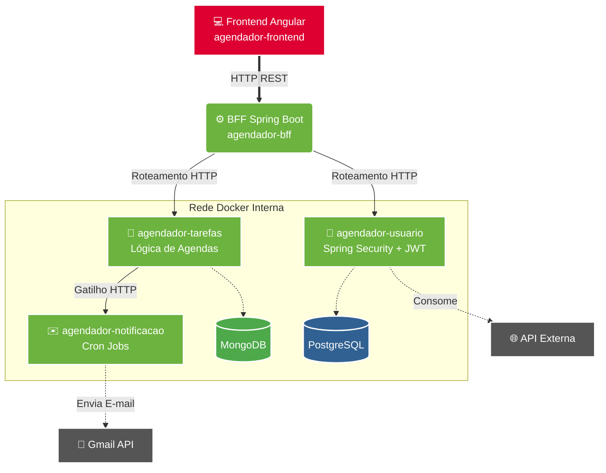

# 📅 Agendador de Tarefas

Sistema completo de gerenciamento de tarefas pessoais desenvolvido com arquitetura de microsserviços. O usuário pode se cadastrar, autenticar e criar, editar e excluir suas próprias agendas, recebendo notificações por e-mail sobre tarefas próximas.
---
🔗 **Em produção:** [dailytasks.tech](https://dailytasks.tech)
---

## 🏗️ Arquitetura


## 📦 Serviços

| Serviço | Repositório | Tecnologia | Responsabilidade |
|---|---|---|---|
| Frontend | [agendador-frontend](https://github.com/AndreLuizDSM/agendador-frontend) | Angular · TypeScript · SCSS | Interface do usuário |
| BFF | [agendador-bff](https://github.com/AndreLuizDSM/agendador-bff) | Java · Spring Boot | Gateway, orquestração, Swagger, tratamento de erros |
| Tarefas | [agendador-tarefas](https://github.com/AndreLuizDSM/agendador-tarefas) | Java · Spring Boot · MongoDB | CRUD de agendas |
| Usuário | [agendador-usuario](https://github.com/AndreLuizDSM/agendador-usuario) | Java · Spring Boot · PostgreSQL | Cadastro, autenticação e integração com API externa |
| Notificação | [agendador-notificacao](https://github.com/AndreLuizDSM/agendador-notificacao) | Java · Spring Boot | Envio de e-mails via Gmail API, usado pelo CRON |

---
## 🛠️ Tecnologias e Conceitos Aplicados

### Backend
- **Java** com **Spring Boot**
- **API REST HTTP** com boas práticas e separação de camadas
- **Programação Orientada a Objetos** e **Injeção de Dependência**
- **Spring Security** com autenticação **JWT**
- **Spring Data JPA** + **PostgreSQL** — CRUD de usuários
- **Spring Data MongoDB** — CRUD de agendas
- **OpenFeign** — comunicação entre microsserviços
- **Swagger / SpringDoc** — documentação da API no BFF
- **Cron Job** — envio automático de verificação de tarefas
- **Gmail API** — envio de notificações por e-mail
- **Integração com API externa** no serviço de usuário e BFF
- **Tratamento de erros** centralizado no BFF
- **CI/CD** com GitHub Actions
- **Docker** — containerização de todos os serviços
- **Docker Compose** — orquestração do ambiente completo
- **SonarQube** — análise estática e refatoração de código

### Frontend
- **Angular** com **TypeScript**
- **Services** — comunicação com APIs
- **Router e RouterState** — navegação e controle de estado de rota
- **HTTP Interceptor** — interceptação e manipulação de requisições HTTP
- **Auth Service** — gerenciamento de autenticação
- **Auth Guard** — proteção de rotas autenticadas

---
## ⏰ Como funciona a janela do CRON de notificações

A cada 5 minutos, um job agendado (`@Scheduled`, expressão CRON `0 0/5 * * * ?`) verifica quais tarefas estão a **exatamente entre 1 hora e 1 hora e 5 minutos** de distância do momento atual, e dispara o e-mail de notificação para as que caem dentro dessa janela.

A janela tem 5 minutos — o mesmo tamanho do intervalo entre execuções — de propósito: isso garante que cada tarefa seja avaliada em exatamente uma execução do CRON, sem lacunas e sem checagem duplicada, desde que nenhum tick seja perdido.

**Exemplo**

O CRON executa às `14:00:00` e calcula:

```
janela = [ agora + 1h , agora + 1h05min )
        = [ 15:00:00 , 15:05:00 )
```

Uma tarefa marcada para `15:03:00` cai dentro dessa janela → o e-mail de lembrete é disparado às `14:00:00`, com cerca de 1 hora de antecedência.

Na execução seguinte, às `14:05:00`, a janela avança para `[15:05:00, 15:10:00)`, cobrindo o próximo bloco de 5 minutos — e assim sucessivamente.

> **Nota sobre timezone:** todos os horários são comparados em UTC. Esse foi, inclusive, o bug mais difícil do projeto: o frontend enviava a data em horário local (BRT, UTC-3) enquanto o backend comparava contra `LocalDateTime.now()` em UTC — uma tarefa marcada para as 11:30 (BRT) era salva como 11:30 (UTC), ou seja, 3 horas no passado em relação à intenção real do usuário, e a janela do CRON, que só olha para frente, nunca a encontrava. A correção foi padronizar o envio da data em UTC a partir do Angular.
---

## 🚀 Como rodar o projeto

### Pré-requisitos
- [Docker](https://www.docker.com/products/docker-desktop) instalado

### Subindo todos os serviços

```bash
git clone https://github.com/AndreLuizDSM/agendador-hub.git
cd agendador-hub
docker-compose up
```
Todos os serviços serão baixados automaticamente do Docker Hub e iniciados.

| Serviço | URL |
|---|---|
| Front-end (Angular) | http://localhost:4200 |
| Usuário | http://localhost:8080 |
| Agendador de Tarefas | http://localhost:8081 |
| Notificação | http://localhost:8082 |
| BFF + Swagger | http://localhost:8083/swagger-ui.html |

### 🔑 Acesso Rápido 
O projeto conta com uma rotina de **Database Seeding**. Ao subir os containers pela primeira vez, o serviço de usuários detecta o banco vazio e injeta automaticamente um usuário padrão com a senha criptografada (BCrypt). 
Você não precisa criar um cadastro do zero para avaliar a plataforma. Utilize as credenciais abaixo na tela de login do Front-end ou via Swagger:

- **E-mail:** `andre.teste.notificacao@gmail.com`
- **Senha:** `senha123`

### Encerrando

```bash
docker-compose down
```
---

## 🐳 Docker Hub

As imagens de todos os serviços estão publicadas em:
[hub.docker.com/u/aominedk](https://hub.docker.com/u/aominedk)

---
## ☁️ Deploy em Produção

O ecossistema está no ar em uma **VPS Linux (Hostinger, Ubuntu)**, executado via **Docker Compose**, e acessível em [dailytasks.tech](https://dailytasks.tech) com HTTPS.

Diferenças principais entre rodar localmente (acima) e o ambiente de produção:

- **Rede entre containers**: os serviços se comunicam entre si pelo nome do serviço no Docker Compose (ex: `http://agendador-tarefas:8081`), não por `localhost` — `localhost` dentro de um container aponta para o próprio container, não para os vizinhos.
- **Firewall**: liberar acesso externo exigiu configuração em mais de uma camada — regras no painel da Hostinger e nas chains do `iptables` (`INPUT`, `FORWARD`/NAT), já que o tráfego passa por várias etapas de filtragem entre a internet e o container de destino.
- **Credenciais**: senhas de banco, chave JWT e credenciais de e-mail ficam fora do versionamento, carregadas como variáveis de ambiente diretamente no servidor — nunca commitadas no repositório.
- **HTTPS**: TLS terminado no **Nginx**, que atua como proxy reverso na frente dos containers; certificado emitido e renovado automaticamente pelo **Certbot** para o domínio `dailytasks.tech`.

O Certbot configura o bloco HTTPS no Nginx automaticamente e agenda a renovação do certificado antes do vencimento.
---
## 👤 Autor

**André Luiz**
- GitHub: [@AndreLuizDSM](https://github.com/AndreLuizDSM)
- LinkedIn: [linkedin.com/in/andreluiz-developer](https://www.linkedin.com/in/andreluiz-developer/)
